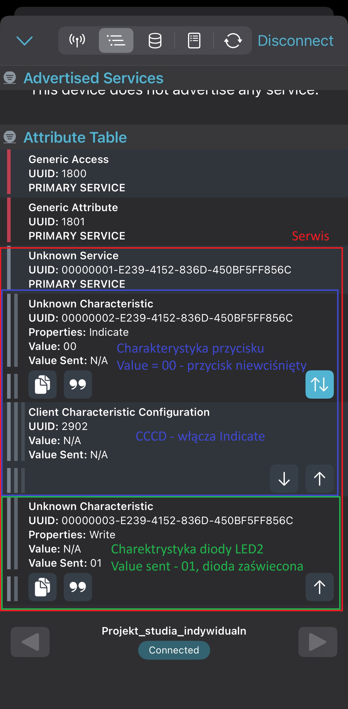

# Aplikacja do sterowania płytką nRF54L15-DK za pomocą BLE na systemie Zephyr RTOS

Głównym zadaniem była możliwość sterowania diodą LED (zapalanie/gaszenie) oraz odczytywanie stanu przycisku przy pomocy protokołu Bluetooth Low Energy. 

## Wykonanie
Program pozwala na połączenie się z płytka nRF54L15-DK za pomocą Bluetooth Low
Energy poprzez wykorzystanie aplikacji mobilnej nRF Connect zainstalowanej na
systemie operacyjnym iOS. Program w połączeniu z aplikacją pozwala nam na
sterowanie diodą LED2 na płytce oraz odczytywanie stanu przycisku BUTTON 0 poprzez zasubskrybowanie odpowiednej charakterystyki.
Do odczytywania stanu przcyisku zastosowano mechanizm Indicate.

## Opis algorytmu
Najpierw określamy parametry ogłaszania (na tej płytce możliwe jest jedynie korzystanie
z BLE, więc dodajemy flagę BT_LE_AD_NO_BREDR oznaczającą, że klasyczny Bluetooth
nie jest wspierany. Definiujemy serwis o nazwe my_service oraz zawarte w nim
charakterystyki wraz z deskryptorem charakterystyki, jeśli dana charakterystyka używa
operacji Notify lub Indicate (odczytywanie stanu przycisku odbywa się za pomocą
operacji Indicate, oczywiście najpierw GATT Client musi zasubskrybować
charakterystykę przycisku, aby otrzymywać powiadomienia). Dla przycisku definiujemy
dodatkowo callback, który wykonuje się, gdy przycisk zmieni swój stan. W tym callbacku
operacja Indicate prześle aktualny stan naszego przycisku. Oczywiście przed tym
wszystkim musimy dla poszczególnych charakterystyk oraz serwisu zdefiniować typ
(UUID) za pomocą makr BT_UUID_128_ENCODE() oraz BT_UUID_DECLARE_128().
Dodatkowo definiujemy kolejnego callbacka, tym razem wykona on się gdy zapiszemy
jakąś wartość do danej charakterystyki (czyli włączymy lub wyłączymy LED2). Następnie
inicjalizujemy biblioteki do kontroli przycisków oraz LED (biblioteka
dk_buttons_and_leds.h). Włączamy BLE oraz inicjalizujemy systemowy workqueue.
Następnie rozpoczynamy rozgłaszanie, które jest wykonywane przez systemową kolejkę
(workqueue). Po sparowaniu obu urządzeń, w aplikacji nRF Connect jesteśmy w stanie
zmienić stan diody LED2 oraz odczytywać stan przycisku BUTTON 0.

**Widok z aplikacji nRF Connect**

